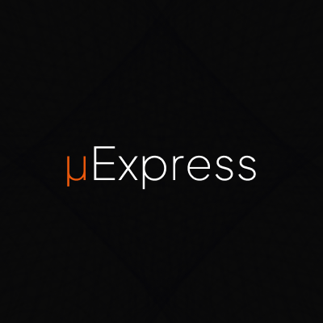

<p align="center">
    
</p>

<h1 align="center">
    μExpress
</h1>

<p align="center">
    An opinionated micro Express.js template to build robust REST APIs.
</p>

### Description

μExpress is an opinionated micro Express.js template designed to help you quickly build robust REST APIs. It integrates several essential tools and libraries for efficient development, while allowing customization to suit your specific project needs.

### Features

-   **Dependency Injection** - μExpress uses [Awilix](https://github.com/jeffijoe/awilix) for dependency injection. This allows you to easily manage dependencies and mock them for testing.
-   **Jest** - μExpress uses [Jest](https://jestjs.io/) for testing. Jest is a powerful testing framework that provides code coverage, mocking, and snapshot testing.
-   **ESLint and Prettier** - μExpress uses [ESLint](https://eslint.org/) and [Prettier](https://prettier.io/) to enforce code style and formatting. This helps keep your code clean and consistent.
-   **TypeScript** - μExpress is written in TypeScript, which provides static type checking and code completion.

### Data Access Layer

μExpress uses the [Repository Pattern](https://deviq.com/repository-pattern/) to abstract away the data access layer.

There is no specific ORM or Database specified in this template, giving you the flexibility to choose and customize your database according to your project requirements.

### Project Structure

The project follows a well-organized directory structure:

```bash
- 📁 src
  - 📁 api :  Contains middlewares and routes for all your API endpoints.
    - 📁 middlewares
    - 📁 routes
  - 📁 loaders : Houses global logic to load API routes and register dependencies for the Dependency Injection container.
  - 📁 services : Services responsible for business logic.
  - 📁 repositories : Repositories responsible for data access.
  - 📁 types : Type definitions for your TypeScript code.
  - 📁 utils : Utility functions and modules.
```

### Getting Started

To get started with this template, follow these steps:

Clone the repository: `git clone https://github.com/adevinwild/micro-express.git`

Install dependencies with your favorite package manager: `yarn install`

Build the project: `yarn build`

Start the development server: `yarn dev`

#### Scripts

**build**: Build the project using TypeScript.
**dev**: Start the development server with automatic restarts using nodemon.
**format**: Format the code using ESLint and Prettier.
**lint**: Lint the code using ESLint.
**start**: Build and start the application.
**test**: Run Jest tests.
